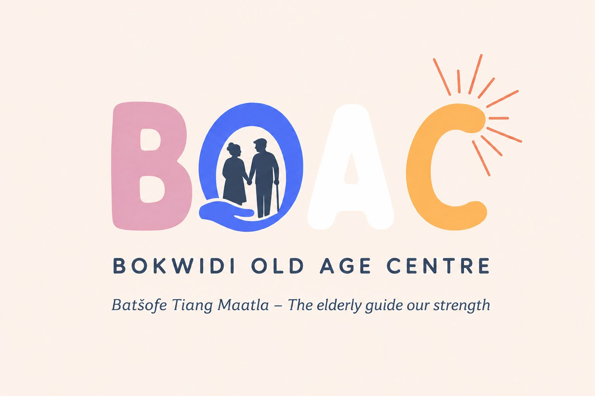

# 

# Bokwidi Old Age Centre — Official Website

> *Batšofe Tiang Maatla — The elderly guide our strength*

A fully responsive, multi-page static website for the **Bokwidi Old Age Centre (BOAC)**, a non-profit organisation based in Bokwidi Village, Waterberg District, Limpopo, South Africa. The website showcases the centre's programmes, community impact, and provides ways for people to get involved and donate.

---

## 📋 Table of Contents

- [About the Project](#about-the-project)
- [Pages](#pages)
- [Tech Stack](#tech-stack)
- [How to Run Locally](#how-to-run-locally)
- [Project Structure](#project-structure)
- [Code Attribution](#code-attribution)

---

## 🏡 About the Project

BOAC supports elderly community members aged 60+ in the Waterberg District through:

- 🍽️ Daily nutritious meals
- 💊 Healthcare access and medical screenings
- 🌍 Community programmes and social activities
- 🌱 Youth development and intergenerational mentorship

This website was built to give BOAC a professional digital presence that reflects the warmth, dignity, and community spirit at the heart of the organisation.

---

## 📄 Pages

| Page | File | Description |
|------|------|-------------|
| 🏠 Home | `index.html` | Landing page with hero, story, programme cards and CTA |
| 👥 About BOAC | `about.html` | Mission, vision, core values, location and impact stats |
| 📋 Programmes | `programmes.html` | Elderly care, youth development and literacy programmes |
| 🌱 Youth Development | `youth.html` | Youth leadership and skills programme detail |
| 📺 Media | `media.html` | Radio, TV, events and press releases with filter tabs |
| 🤝 Get Involved | `get-involved.html` | Ways to volunteer, partner or donate resources |
| 📝 Volunteer | `volunteer.html` | Volunteer application form |
| 💰 Donate | `donate.html` | Bank transfer details and impact breakdown |
| 📞 Contact | `contact.html` | Contact form, address, hours and location |

---

## 🛠️ Tech Stack

| Technology | Purpose |
|------------|---------|
| **HTML5** | Semantic page structure |
| **CSS3** | Styling, animations, responsive layout |
| **Vanilla JavaScript** | Interactivity, scroll animations, form handling |
| **Google Fonts** | Inter (body) + Lora (headings) typography |
| **CSS Grid & Flexbox** | Responsive multi-column layouts |
| **IntersectionObserver API** | Scroll-triggered fade-in animations |

> No frameworks, no dependencies — pure HTML, CSS and JavaScript.

---

## 🚀 How to Run Locally

This is a **static website** — no build step or server required.

### Option 1 — Open directly (simplest)
1. Clone or download this repository
2. Double-click `index.html` to open in your browser

### Option 2 — VS Code Live Server (recommended for development)
1. Install the [Live Server](https://marketplace.visualstudio.com/items?itemName=ritwickdey.LiveServer) extension in VS Code
2. Open the project folder in VS Code
3. Right-click `index.html` → **Open with Live Server**
4. The site auto-refreshes on every save

### Option 3 — Python local server
```bash
cd path/to/BOAC-website
python -m http.server 8080
# Open http://localhost:8080 in your browser
```

---

## 📁 Project Structure

```
BOAC-website/
│
├── index.html              # Home page
├── about.html              # About BOAC
├── programmes.html         # Programmes
├── youth.html              # Youth Development
├── media.html              # Media
├── get-involved.html       # Get Involved
├── volunteer.html          # Volunteer application
├── donate.html             # Donate
├── contact.html            # Contact
│
├── css/
│   └── styles.css          # Full design system & all page styles
│
├── js/
│   └── main.js             # Navbar, animations, counters, form handling
│
└── assets/
    └── images/
        ├── boac-logo.png           # Official BOAC logo
        ├── hero-elder.png          # Home story section image
        ├── about-hero.png          # About page hero image
        ├── donate-hero.png         # Donate page image
        ├── programme-learning.png  # Literacy programme image
        ├── programme-skills.png    # Elderly support image
        └── programme-youth.png     # Youth development image
```

---

## 📚 Code Attribution

All external resources used in this project are referenced in Harvard format as comments at the top of each source file.

**Key references:**

- Google LLC (2024) *Google Fonts — Inter Typeface* [online]. Available at: https://fonts.google.com/specimen/Inter (Accessed: 16 August 2026)
- Google LLC (2024) *Google Fonts — Lora Typeface* [online]. Available at: https://fonts.google.com/specimen/Lora (Accessed: 16 August 2026)
- Mozilla Developer Network (2024) *Intersection Observer API* [online]. Available at: https://developer.mozilla.org/en-US/docs/Web/API/Intersection_Observer_API (Accessed: 16 August 2026)
- Mozilla Developer Network (2024) *CSS Grid Layout* [online]. Available at: https://developer.mozilla.org/en-US/docs/Web/CSS/CSS_grid_layout (Accessed: 16 August 2026)
- Mozilla Developer Network (2024) *CSS Flexible Box Layout* [online]. Available at: https://developer.mozilla.org/en-US/docs/Web/CSS/CSS_flexible_box_layout (Accessed: 16 August 2026)
- World Wide Web Consortium (2014) *HTML5 Specification* [online]. Available at: https://www.w3.org/TR/html5/ (Accessed: 16 August 2026)

---

## 📍 Organisation Details

| | |
|---|---|
| **Organisation** | Bokwidi Old Age Centre |
| **Location** | Bokwidi Village, Waterberg District, Limpopo, South Africa |
| **Email** | info@bokwidioldagecentre.org.za |
| **Phone** | +27 (0)15 123 4567 |
| **Hours** | Monday – Friday: 08:00 – 16:00 |
| **Non-Profit** | Registered NPO |

---

*Built with ❤️ for the elders of Bokwidi Village.*
