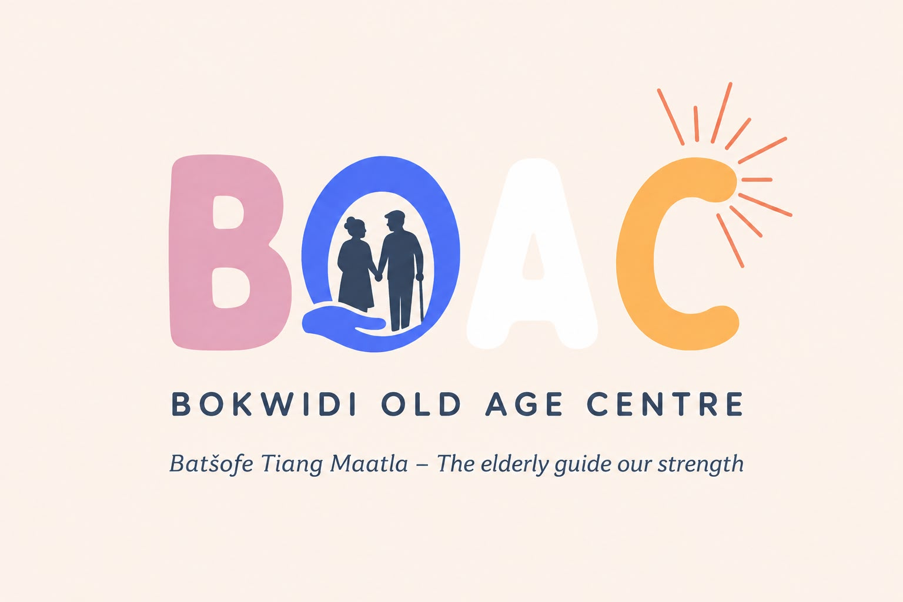

# Volunteer Platform

This repository contains a full-stack volunteer management and public engagement platform for a community organisation. The application combines a public-facing website with protected admin and volunteer dashboards for managing content, opportunities, applications, assignments, and event logistics.

## Overview

The system is split into two main services:

- Backend: Hono + TypeScript API with MongoDB persistence, Better Auth for authentication, and S3-compatible storage for uploaded assets.
- Frontend: React + Vite + TypeScript client for the public site, admin desk, and volunteer workflow.

For the full API route reference, auth model, and endpoint summary, see [backend/README.md](backend/README.md).

## Features

- Public website pages for programmes, volunteering, contact, media, and donation information
- Volunteer desk for schedules, spaces, and work allocation
- Admin desk for managing opportunities, applications, assignments, content, and messages
- Role-based access using admin and volunteer user roles
- Content and opportunity CRUD routes served by the backend API
- S3-backed media storage and MongoDB data persistence
- Health checks for database and bucket connectivity

## Repository structure

- `backend/` — API server, auth, DB access, storage, and route definitions
- `frontend/` — React app for the public and staff interfaces
- `docs/` — research notes and work logs for the project

## Tech stack

- Frontend: React 19, Vite, React Router, TanStack Query, TypeScript
- Backend: Hono, TypeScript, MongoDB, Better Auth, Zod
- Storage: AWS S3-compatible bucket
- Deployment notes: Railway and Docker are configured for backend/frontend hosting

## Local development

### 1. Configure the backend environment

Create a `.env` file inside the `backend/` directory with the required variables:

```env
PORT=3000
FRONTEND_ORIGIN=http://localhost:5173
BETTER_AUTH_SECRET=replace-with-a-long-random-secret
BETTER_AUTH_URL=http://localhost:3000

MONGODB_URI=mongodb://localhost:27017
MONGODB_DB=boac

AWS_ENDPOINT_URL=https://your-s3-endpoint
AWS_DEFAULT_REGION=auto
AWS_ACCESS_KEY_ID=your-access-key
AWS_SECRET_ACCESS_KEY=your-secret-key
AWS_S3_BUCKET_NAME=your-bucket-name

ADMIN_EMAIL=admin@example.com
ADMIN_PASSWORD=ChangeMe123!

VOLUNTEER_EMAIL=volunteer@example.com
VOLUNTEER_PASSWORD=ChangeMe123!
```

> The app expects MongoDB and an S3-compatible object store to be available during local development.

### 2. Install dependencies

```bash
cd backend
npm install

cd ../frontend
npm install
```

### 3. Start the backend

```bash
cd backend
npm run dev
```

The backend listens on `http://localhost:3000` by default.

### 4. Start the frontend

```bash
cd frontend
npm run dev
```

The frontend runs at `http://localhost:5173` by default.

## Available scripts

### Backend

```bash
npm run dev
npm run db:setup
npm run build
npm run start
```

### Frontend

```bash
npm run dev
npm run build
npm run preview
```

## Notes

- The frontend client is typed from the backend route tree (`AppType` in `backend/src/index.ts`).
- `frontend` builds with TypeScript checks and the project expects backend dependencies to be installed before production builds are run in the frontend.
- The backend exposes a `/health` route that reports database and bucket connectivity.
- Admin and volunteer default users are created automatically when their corresponding environment values are present.

## Project status

This codebase is a work-in-progress volunteer platform with a public site, protected staff areas, and a backend API suitable for integration with MongoDB and storage-backed media workflows.

---

# Original BOAC Static Website

## 

## Bokwidi Old Age Centre — Official Website

> *Batšofe Tiang Maatla — The elderly guide our strength*

A fully responsive, multi-page static website for the **Bokwidi Old Age Centre (BOAC)**, a non-profit organisation based in Bokwidi Village, Waterberg District, Limpopo, South Africa. The website showcases the centre's programmes, community impact, and provides ways for people to get involved and donate.

---

### 📋 Table of Contents

- [About the Project](#about-the-project)
- [Pages](#pages)
- [Tech Stack](#tech-stack)
- [How to Run Locally](#how-to-run-locally)
- [Project Structure](#project-structure)
- [Code Attribution](#code-attribution)

---

### 🏡 About the Project

BOAC supports elderly community members aged 60+ in the Waterberg District through:

- 🍽️ Daily nutritious meals
- 💊 Healthcare access and medical screenings
- 🌍 Community programmes and social activities
- 🌱 Youth development and intergenerational mentorship

This website was built to give BOAC a professional digital presence that reflects the warmth, dignity, and community spirit at the heart of the organisation.

---

### 📄 Pages

| Page | File | Description |
|------|------|-------------|
| 🏠 Home | `index.html` | Landing page with hero, story, programme cards and CTA |
| 👥 About BOAC | `about.html` | Mission, vision, core values, location and impact stats |
| 📋 Programmes | `programmes.html` | Elderly care, youth development and literacy programmes |
| 🌱 Youth Development | `youth.html` | Youth leadership and skills programme detail |
| 📺 Media | `media.html` | Radio, TV, events and press releases with filter tabs |
| 🤝 Get Involved | `get-involved.html` | Ways to volunteer, partner or donate resources |
| 📝 Volunteer | `volunteer.html` | Volunteer application form |
| 💰 Donate | `donate.html` | Bank transfer details and impact breakdown |
| 📞 Contact | `contact.html` | Contact form, address, hours and location |

---

### 🛠️ Tech Stack

| Technology | Purpose |
|------------|---------|
| **HTML5** | Semantic page structure |
| **CSS3** | Styling, animations, responsive layout |
| **Vanilla JavaScript** | Interactivity, scroll animations, form handling |
| **Google Fonts** | Inter (body) + Lora (headings) typography |
| **CSS Grid & Flexbox** | Responsive multi-column layouts |
| **IntersectionObserver API** | Scroll-triggered fade-in animations |

> No frameworks, no dependencies — pure HTML, CSS and JavaScript.

---

### 🚀 How to Run Locally

This is a **static website** — no build step or server required.

#### Option 1 — Open directly (simplest)
1. Clone or download this repository
2. Double-click `index.html` to open in your browser

#### Option 2 — VS Code Live Server (recommended for development)
1. Install the [Live Server](https://marketplace.visualstudio.com/items?itemName=ritwickdey.LiveServer) extension in VS Code
2. Open the project folder in VS Code
3. Right-click `index.html` → **Open with Live Server**
4. The site auto-refreshes on every save

#### Option 3 — Python local server
```bash
cd path/to/BOAC-website
python -m http.server 8080
## Open http://localhost:8080 in your browser
```

---

### 📁 Project Structure

```
BOAC-website/
│
├── index.html              # Home page
├── about.html              # About BOAC
├── programmes.html         # Programmes
├── youth.html              # Youth Development
├── media.html              # Media
├── get-involved.html       # Get Involved
├── volunteer.html          # Volunteer application
├── donate.html             # Donate
├── contact.html            # Contact
│
├── css/
│   └── styles.css          # Full design system & all page styles
│
├── js/
│   └── main.js             # Navbar, animations, counters, form handling
│
└── assets/
    └── images/
        ├── boac-logo.png           # Official BOAC logo
        ├── hero-elder.png          # Home story section image
        ├── about-hero.png          # About page hero image
        ├── donate-hero.png         # Donate page image
        ├── programme-learning.png  # Literacy programme image
        ├── programme-skills.png    # Elderly support image
        └── programme-youth.png     # Youth development image
```

---

### 📚 Code Attribution

All external resources used in this project are referenced in Harvard format as comments at the top of each source file.

**Key references:**

- Google LLC (2024) *Google Fonts — Inter Typeface* [online]. Available at: https://fonts.google.com/specimen/Inter (Accessed: 16 August 2026)
- Google LLC (2024) *Google Fonts — Lora Typeface* [online]. Available at: https://fonts.google.com/specimen/Lora (Accessed: 16 August 2026)
- Mozilla Developer Network (2024) *Intersection Observer API* [online]. Available at: https://developer.mozilla.org/en-US/docs/Web/API/Intersection_Observer_API (Accessed: 16 August 2026)
- Mozilla Developer Network (2024) *CSS Grid Layout* [online]. Available at: https://developer.mozilla.org/en-US/docs/Web/CSS/CSS_grid_layout (Accessed: 16 August 2026)
- Mozilla Developer Network (2024) *CSS Flexible Box Layout* [online]. Available at: https://developer.mozilla.org/en-US/docs/Web/CSS/CSS_flexible_box_layout (Accessed: 16 August 2026)
- World Wide Web Consortium (2014) *HTML5 Specification* [online]. Available at: https://www.w3.org/TR/html5/ (Accessed: 16 August 2026)

---

### 📍 Organisation Details

| | |
|---|---|
| **Organisation** | Bokwidi Old Age Centre |
| **Location** | Bokwidi Village, Waterberg District, Limpopo, South Africa |
| **Email** | info@bokwidioldagecentre.org.za |
| **Phone** | +27 (0)15 123 4567 |
| **Hours** | Monday – Friday: 08:00 – 16:00 |
| **Non-Profit** | Registered NPO |

---

*Built with ❤️ for the elders of Bokwidi Village.*
