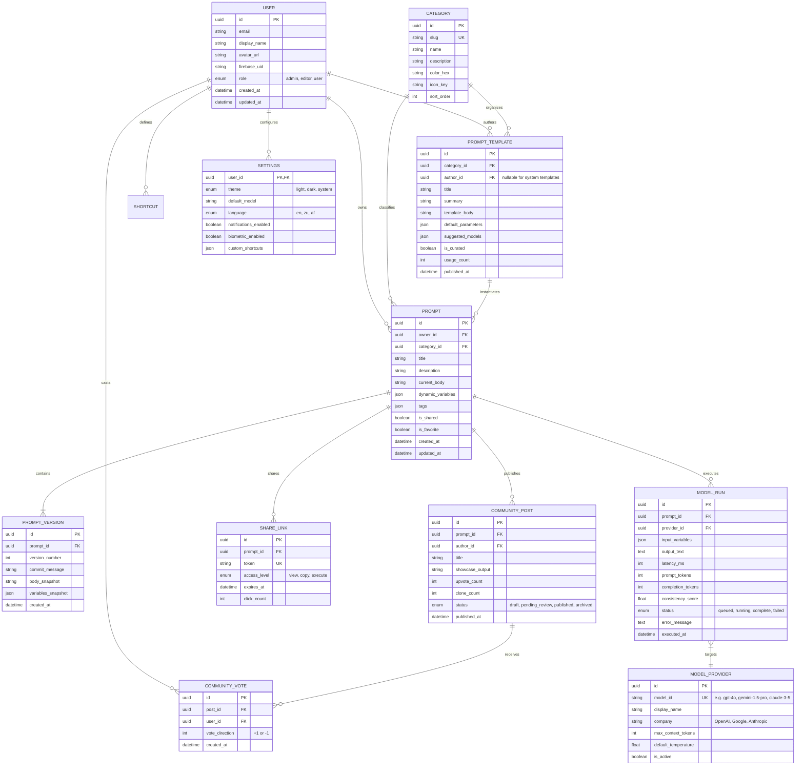
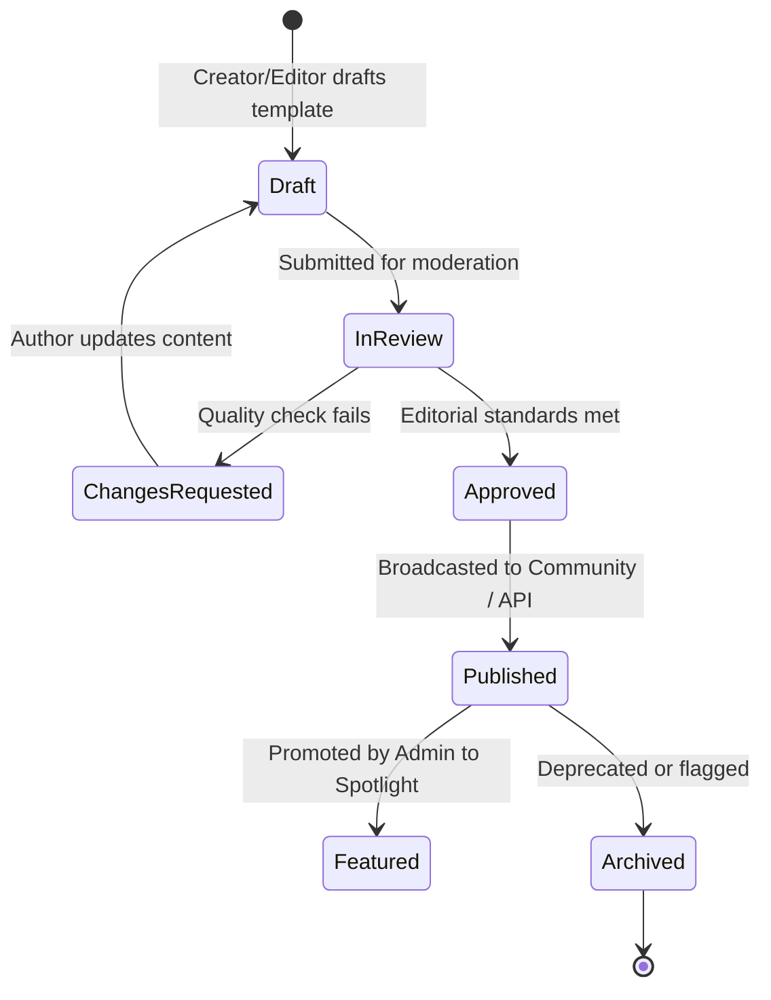

# VEX — Shared Content Model for CMS (Task 1.3)
**Author:** Bokamoso Sebake (BK — UI/UX Design Lead & Content Architect)  
**Project:** VEX AI Prompt Library (PROG7314 / INSY7315 Task 2)  
**Target:** Headless CMS Architecture & Cross-Platform Schema Definition  

---

## 1. Overview & Architecture Strategy

The VEX Shared Content Model defines the unified data contracts and content lifecycle across the **Headless CMS Engine**, the **Node.js/Express REST API**, the **PostgreSQL Cloud Database**, and the **Android Native Client (RoomDB SQLite)**.

### Architectural Principles:
* **Decoupled Omnichannel Delivery**: Content models are consumed uniformly via REST/JSON by web frontends, mobile clients, and automated CLI tools.
* **Granular Revision Tracking**: All prompts and templates support structural versioning (`PromptVersion`) allowing rollback, branching, and longitudinal scoring.
* **Offline Reconciliation**: Every entity maintains `createdAt`, `updatedAt`, and `version` timestamps enabling deterministic Last-Write-Wins (LWW) conflict resolution during mobile sync.

---

## 2. Entity-Relationship Diagram (ERD)



---

## 3. Detailed Entity & Field Specifications

### 3.1 `Prompt` & `PromptVersion` Content Type
Represents the primary user asset within the workbench.

```json
{
  "$schema": "http://json-schema.org/draft-07/schema#",
  "title": "Prompt",
  "type": "object",
  "properties": {
    "id": { "type": "string", "format": "uuid" },
    "ownerId": { "type": "string", "format": "uuid" },
    "categoryId": { "type": "string", "format": "uuid" },
    "title": { "type": "string", "minLength": 1, "maxLength": 120 },
    "description": { "type": "string", "maxLength": 500 },
    "currentBody": { 
      "type": "string", 
      "description": "Raw prompt text with {variable} placeholders"
    },
    "dynamicVariables": {
      "type": "array",
      "items": {
        "type": "object",
        "properties": {
          "name": { "type": "string" },
          "defaultValue": { "type": "string" },
          "description": { "type": "string" },
          "isRequired": { "type": "boolean" }
        },
        "required": ["name", "isRequired"]
      }
    },
    "tags": {
      "type": "array",
      "items": { "type": "string" }
    },
    "isShared": { "type": "boolean", "default": false },
    "isFavorite": { "type": "boolean", "default": false },
    "createdAt": { "type": "string", "format": "date-time" },
    "updatedAt": { "type": "string", "format": "date-time" }
  },
  "required": ["id", "ownerId", "categoryId", "title", "currentBody"]
}
```

---

### 3.2 `PromptTemplate` (Curated / CMS Template)
Editorial content authored by administrators or vetted community contributors.

```json
{
  "$schema": "http://json-schema.org/draft-07/schema#",
  "title": "PromptTemplate",
  "type": "object",
  "properties": {
    "id": { "type": "string", "format": "uuid" },
    "categoryId": { "type": "string", "format": "uuid" },
    "authorId": { "type": ["string", "null"], "format": "uuid" },
    "title": { "type": "string", "maxLength": 100 },
    "summary": { "type": "string", "maxLength": 280 },
    "templateBody": { "type": "string" },
    "defaultParameters": {
      "type": "object",
      "additionalProperties": { "type": "string" }
    },
    "suggestedModels": {
      "type": "array",
      "items": { "type": "string" }
    },
    "isCurated": { "type": "boolean", "default": true },
    "usageCount": { "type": "integer", "minimum": 0 },
    "publishedAt": { "type": "string", "format": "date-time" }
  },
  "required": ["id", "categoryId", "title", "templateBody"]
}
```

---

### 3.3 `ModelRun` (Telemetry & Execution Output)
Captures execution logs, performance latency, token metrics, and accuracy scoring.

| Field | Type | Description |
| :--- | :--- | :--- |
| `id` | `UUID` (PK) | Unique run execution identifier |
| `promptId` | `UUID` (FK) | Reference to parent `Prompt` |
| `providerId` | `UUID` (FK) | Reference to `ModelProvider` (e.g., GPT-4o) |
| `inputVariables` | `JSON` | Key-value mapping of injected runtime variables |
| `outputText` | `TEXT` | Raw model completion returned by provider |
| `latencyMs` | `INT` | End-to-end response latency in milliseconds |
| `promptTokens` | `INT` | Token count of assembled input |
| `completionTokens`| `INT` | Token count of model response |
| `consistencyScore`| `FLOAT` | Heuristic evaluation score (0.00 – 1.00) |
| `status` | `ENUM` | `queued`, `running`, `complete`, `failed` |
| `executedAt` | `DATETIME` | UTC timestamp of run initiation |

---

## 4. CMS Editorial Workflow & Content Lifecycle



---

## 5. Conflict Resolution & Offline Synchronization Rules

1. **Last-Write-Wins (LWW)**:
   * Each record maintains a monotonic `updatedAt` UTC timestamp.
   * When Android `WorkManager` flushes offline mutations, the API compares incoming `updatedAt` against PostgreSQL state. If client timestamp is newer, write succeeds; otherwise, server responds with `409 Conflict` and latest snapshot.
2. **Cascade Deletion Integrity**:
   * Deleting a `Prompt` cascades and hard-deletes associated `PromptVersion` and `ShareLink` records.
   * `ModelRun` records can be optionally preserved with `prompt_id` set to `NULL` to maintain anonymous execution telemetry.
