# Bokwidi Old Age Centre (BOAC) — Shared Content Model for CMS (Task 1.3)
**Author:** Bokamoso Sebake (BK — ST10440322 | UI/UX Lead & Data Architect)  
**Module:** INSY7315 Information System 3E (Task 2)  
**Client:** Bokwidi Old Age Centre (BOAC), Extension 2, Diepsloot, Gauteng  
**Target Backend:** Supabase (PostgreSQL 15+) / Express REST API  

---

## 1. Overview & Data Architecture Strategy

The BOAC Shared Content Model defines the authoritative database schemas, content types, and relational integrity rules across all digital touchpoints:
* **Public Web Application (Next.js)**: Consumes published content, media items, programmes, and impact statistics.
* **Mobile Companion App (React Native Expo)**: Fetches cached events, youth opportunities, and offline community resources.
* **Coordinator CMS Portal**: Secured operational workbench for managing content and processing incoming volunteer applications.

### Architecture Principles:
1. **Relational Consistency**: Enforced foreign keys, unique slugs, and database-level constraints using PostgreSQL.
2. **POPIA Compliance by Design**: Encryption at rest (AES-256), data minimization for public forms, and strict Row-Level Security (RLS) preventing unauthorized exposure of volunteer and enquiry records.
3. **Optimistic Caching & High Availability**: Static generation for high-traffic public pages backed by edge CDN caching, coupled with real-time Supabase subscriptions for the Coordinator Portal.

---

## 2. Entity-Relationship Diagram (ERD)

```mermaid
erDiagram
    ROLES ||--o{ USERS : assigns
    USERS ||--o{ POSTS_AND_ARTICLES : authors
    USERS ||--o{ MEDIA_ITEMS : publishes
    USERS ||--o{ GALLERY_ITEMS : uploads
    USERS ||--o{ EVENTS : creates
    USERS ||--o{ VOLUNTEER_APPLICATIONS : reviews
    USERS ||--o{ CONTACT_ENQUIRIES : resolves

    CATEGORIES ||--o{ POSTS_AND_ARTICLES : classifies
    CATEGORIES ||--o{ MEDIA_ITEMS : categorizes
    CATEGORIES ||--o{ GALLERY_ITEMS : tags

    ROLES {
        uuid id PK
        string name UK "SuperAdmin, ContentAdmin, VolunteerCoordinator"
        string description
        datetime created_at
    }

    USERS {
        uuid id PK
        uuid role_id FK
        string email UK
        string full_name
        string avatar_url
        boolean is_active
        datetime created_at
        datetime updated_at
    }

    CATEGORIES {
        uuid id PK
        string slug UK
        string name
        string description
        string color_hex
        int sort_order
    }

    PROGRAMMES {
        uuid id PK
        string slug UK
        string title
        string short_summary
        text full_description
        string icon_key
        string cover_image_url
        int sort_order
        boolean is_active
        datetime updated_at
    }

    POSTS_AND_ARTICLES {
        uuid id PK
        uuid author_id FK
        uuid category_id FK
        string title
        string slug UK
        string summary
        text content_html
        string cover_image_url
        enum status "draft, published, archived"
        datetime published_at
        datetime created_at
    }

    MEDIA_ITEMS {
        uuid id PK
        uuid author_id FK
        uuid category_id FK
        string title
        enum media_type "radio, tv, press, event, video"
        string media_url
        string thumbnail_url
        date broadcast_date
        boolean is_featured
        datetime created_at
    }

    GALLERY_ITEMS {
        uuid id PK
        uuid uploader_id FK
        uuid category_id FK
        string title
        string caption
        string image_url
        date taken_at
        datetime created_at
    }

    EVENTS {
        uuid id PK
        uuid creator_id FK
        string title
        text description
        string location
        datetime start_datetime
        datetime end_datetime
        boolean is_active
        datetime created_at
    }

    TESTIMONIALS {
        uuid id PK
        string beneficiary_name
        string role_or_zone "e.g. Elder - Zone 2, Volunteer"
        text quote
        string photo_url
        boolean is_featured
        int sort_order
    }

    VOLUNTEER_APPLICATIONS {
        uuid id PK
        uuid reviewed_by FK "nullable"
        string full_name
        string email
        string phone
        string physical_zone "Zone 1 to 5, Diepsloot"
        string area_of_interest "Kitchen, Farming, Literacy, Elder Care"
        text skills_and_experience
        string availability "Weekdays, Weekends, Full-time"
        boolean popia_consent "Must be true"
        enum status "submitted, under_review, contacted, accepted, declined"
        text internal_notes
        datetime submitted_at
        datetime updated_at
    }

    CONTACT_ENQUIRIES {
        uuid id PK
        uuid resolved_by FK "nullable"
        string full_name
        string email
        string phone
        string subject
        text message
        boolean is_resolved
        datetime created_at
    }

    PARTNERSHIP_ENQUIRIES {
        uuid id PK
        string organisation_name
        string contact_person
        string email
        string phone
        string partnership_type "Corporate Sponsor, NGO, Government, In-Kind"
        text proposal_message
        boolean is_resolved
        datetime created_at
    }

    OPPORTUNITIES {
        uuid id PK
        string title
        enum type "bursary, learnership, internship, workshop"
        string provider_name
        string education_level
        string location
        date closing_date
        string application_url
        boolean is_verified
        datetime created_at
    }

    SITE_STATISTICS {
        uuid id PK
        int households_supported "Default 800+"
        int community_zones "Default 5"
        int age_eligibility_min "Default 60"
        int meals_served_monthly
        int active_volunteers
        datetime last_audited_at
    }

    DONATION_DETAILS {
        uuid id PK
        string bank_name
        string account_holder
        string account_number
        string account_type
        string branch_code
        string swift_code
        string reference_instructions
        boolean is_active
    }
```



---

## 3. Detailed Entity Definitions & Field Schemas

### 3.1 `volunteer_applications` (Intake & POPIA Pipeline)
Captures volunteer submissions with complete compliance validation and coordinator review states.

```sql
CREATE TYPE volunteer_status_enum AS ENUM (
  'submitted', 
  'under_review', 
  'contacted', 
  'accepted', 
  'declined'
);

CREATE TABLE volunteer_applications (
  id UUID PRIMARY KEY DEFAULT gen_random_uuid(),
  full_name VARCHAR(120) NOT NULL,
  email VARCHAR(255) NOT NULL,
  phone VARCHAR(20) NOT NULL,
  physical_zone VARCHAR(100) NOT NULL,
  area_of_interest VARCHAR(100) NOT NULL,
  skills_and_experience TEXT,
  availability VARCHAR(100) NOT NULL,
  popia_consent BOOLEAN NOT NULL DEFAULT FALSE,
  status volunteer_status_enum NOT NULL DEFAULT 'submitted',
  reviewed_by UUID REFERENCES users(id) ON DELETE SET NULL,
  internal_notes TEXT,
  submitted_at TIMESTAMPTZ NOT NULL DEFAULT NOW(),
  updated_at TIMESTAMPTZ NOT NULL DEFAULT NOW()
);
```

---

### 3.2 `programmes` (7 Core Community Pillars)
Stores the primary service pillars offered by the centre.

```json
{
  "$schema": "http://json-schema.org/draft-07/schema#",
  "title": "Programme",
  "type": "object",
  "properties": {
    "id": { "type": "string", "format": "uuid" },
    "slug": { "type": "string", "pattern": "^[a-z0-9-]+$" },
    "title": { "type": "string", "maxLength": 100 },
    "shortSummary": { "type": "string", "maxLength": 255 },
    "fullDescription": { "type": "string" },
    "iconKey": { "type": "string" },
    "coverImageUrl": { "type": "string", "format": "uri" },
    "sortOrder": { "type": "integer" },
    "isActive": { "type": "boolean", "default": true }
  },
  "required": ["id", "slug", "title", "shortSummary", "fullDescription"]
}
```

---

### 3.3 `donation_details` (1-Tap Direct Bank Transfer)
Stores official banking details presented to donors for direct electronic funds transfer (EFT).

```json
{
  "$schema": "http://json-schema.org/draft-07/schema#",
  "title": "DonationDetails",
  "type": "object",
  "properties": {
    "bankName": { "type": "string", "example": "First National Bank (FNB)" },
    "accountHolder": { "type": "string", "example": "Bokwidi Old Age Centre NPO" },
    "accountNumber": { "type": "string", "example": "62894102934" },
    "accountType": { "type": "string", "example": "Public Benefit Organization Cheque Account" },
    "branchCode": { "type": "string", "example": "250655" },
    "swiftCode": { "type": "string", "example": "FIRNZAJJ" },
    "referenceInstructions": { "type": "string", "example": "YourName-Donation" }
  },
  "required": ["bankName", "accountHolder", "accountNumber", "branchCode"]
}
```

---

## 4. Row-Level Security (RLS) & Access Governance

In compliance with the **Protection of Personal Information Act (POPIA)** and OWASP Top 10 security standards, Supabase RLS is configured as follows:

```sql
-- Enable RLS on all sensitive tables
ALTER TABLE volunteer_applications ENABLE ROW LEVEL SECURITY;
ALTER TABLE contact_enquiries ENABLE ROW LEVEL SECURITY;
ALTER TABLE posts_and_articles ENABLE ROW LEVEL SECURITY;

-- 1. Volunteer Applications: Public can INSERT only; Authenticated coordinators can SELECT and UPDATE
CREATE POLICY "Allow public volunteer submissions" 
ON volunteer_applications 
FOR INSERT 
TO anon 
WITH CHECK (popia_consent = true);

CREATE POLICY "Allow coordinators full access to volunteer applications" 
ON volunteer_applications 
FOR ALL 
TO authenticated 
USING (auth.jwt() ->> 'role' IN ('SuperAdmin', 'VolunteerCoordinator'));

-- 2. Public Content: Anonymous users can SELECT published content only
CREATE POLICY "Public can view published posts" 
ON posts_and_articles 
FOR SELECT 
TO anon 
USING (status = 'published');

CREATE POLICY "Coordinators can manage all posts" 
ON posts_and_articles 
FOR ALL 
TO authenticated 
USING (auth.jwt() ->> 'role' IN ('SuperAdmin', 'ContentAdmin'));
```

---

## 5. Seed Data Specifications

The initial database migration automatically seeds the core pillars and baseline statistics:

* **Site Statistics**: `households_supported = 800`, `community_zones = 5`, `age_eligibility_min = 60`, `meals_served_monthly = 3200`.
* **The 7 Core Programmes**:
  1. *Elderly Support & Day Care* (`slug: elderly-support`)
  2. *Cooking & Nutritional Feeding Scheme* (`slug: nutrition-feeding`)
  3. *Horticulture & Organic Community Farming* (`slug: horticulture-farming`)
  4. *Community Wellness & Health Screening* (`slug: wellness-healthcare`)
  5. *Adult Literacy & Continuing Education* (`slug: literacy-education`)
  6. *Youth Mentorship & Development* (`slug: youth-mentorship`)
  7. *Cultural Heritage Preservation & Oral History* (`slug: cultural-heritage`)
