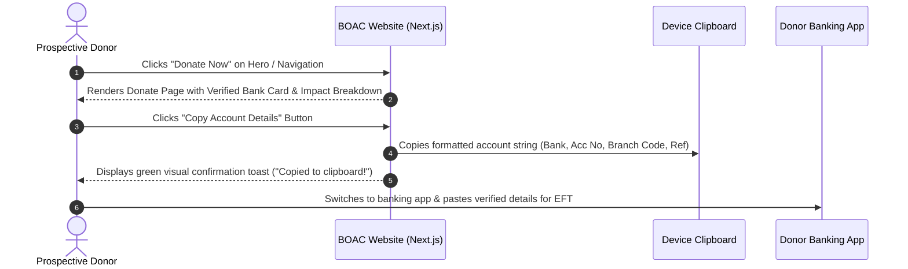
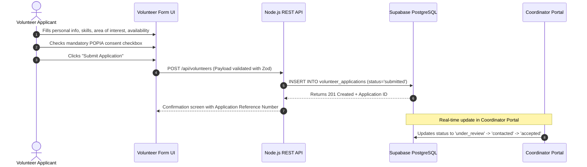
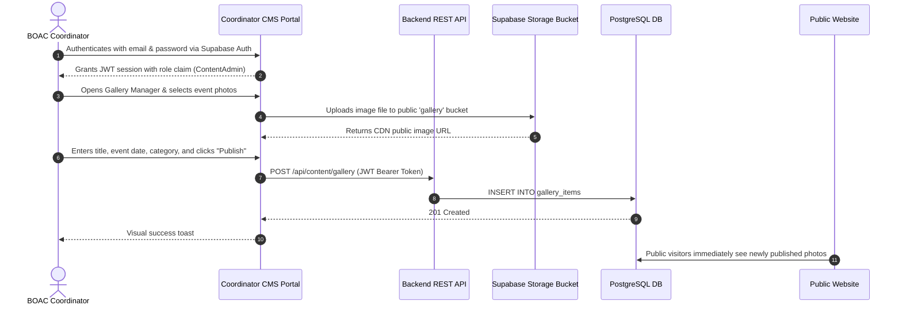

# Bokwidi Old Age Centre (BOAC) — Information Architecture Specification (Task 1.3)
**Author:** Bokamoso Sebake (BK — ST10440322 | UI/UX Lead & System Architect)  
**Module:** INSY7315 Information System 3E (Task 2)  
**Client:** Bokwidi Old Age Centre (BOAC), Extension 2, Diepsloot, Gauteng  
**Motto:** *Batšofe Tiang Maatla – The elderly guide our strength*  

---

## 1. Context & Architectural Objectives

The **Bokwidi Old Age Centre (BOAC)** operates in Extension 2, Diepsloot, Gauteng, providing essential welfare, nutrition, wellness, literacy, and youth mentorship to over **800 vulnerable households** across **5 community zones**. 

Historically constrained by manual paper registers and fragmented social media channels, BOAC requires a unified digital ecosystem connecting:
1. A **Public Responsive Web Application** (Next.js / Tailwind CSS) designed for donors, volunteers, community members, and local youth.
2. A **Companion Mobile App** (React Native Expo) for community discovery, events, and offline-accessible guides.
3. A **Secured Coordinator CMS Dashboard** powered by a Node.js REST API and Supabase (PostgreSQL) for administrative content management and volunteer vetting.

### Key Architectural Pillars:
* **Elderly-First Accessibility (WCAG 2.1 AA)**: High-contrast typography (minimum 4.5:1), large legible touch targets ($\ge 44\text{px}$), clear iconography paired with descriptive text, and minimal cognitive load.
* **Low-Bandwidth Optimization**: Lightweight page footprints ($< 3\text{s}$ load on 3G/4G networks), CDN asset compression, and direct offline-friendly layouts.
* **POPIA Compliance by Design**: Explicit opt-in consent checkboxes, minimal data collection, secure encrypted storage, and restricted coordinator access tiers.
* **Frictionless Giving & Volunteering**: 1-tap clipboard copying for direct banking transfers (eliminating complex gateways and PCI-DSS overhead) and a structured 4-step volunteer vetting pipeline.

---

## 2. Complete System Sitemap & Information Hierarchy

```mermaid
graph TD
    Root[BOAC Digital Platform] --> Public[1.0 Public Web Platform]
    Root --> Youth[2.0 Youth Opportunity Hub]
    Root --> Mobile[3.0 Companion Mobile App]
    Root --> Admin[4.0 Coordinator CMS Portal]

    %% 1.0 Public Web
    Public --> P_Home[1.1 Home / Landing Page]
    Public --> P_About[1.2 About BOAC - History, Mission, Values]
    Public --> P_Prog[1.3 7 Core Programmes]
    Public --> P_Media[1.4 Media & Press Coverage]
    Public --> P_Gallery[1.5 Community Photo Gallery]
    Public --> P_Involve[1.6 Get Involved & Partnerships]
    Public --> P_Vol[1.7 Volunteer Application Portal]
    Public --> P_Donate[1.8 1-Tap Donate & Banking Details]
    Public --> P_Contact[1.9 Contact & Location Map]

    %% 1.3 Programmes
    P_Prog --> PR_Elderly[1.3.1 Elderly Support & Day Care]
    P_Prog --> PR_Nutr[1.3.2 Cooking & Nutritional Feeding]
    P_Prog --> PR_Farm[1.3.3 Horticulture & Farming]
    P_Prog --> PR_Health[1.3.4 Community Wellness & Healthcare]
    P_Prog --> PR_Lit[1.3.5 Literacy & Adult Education]
    P_Prog --> PR_Youth[1.3.6 Youth Mentorship & Development]
    P_Prog --> PR_Cult[1.3.7 Cultural Heritage Preservation]

    %% 2.0 Youth Hub
    Youth --> Y_Bursary[2.1 Verified Bursaries & Funding]
    Youth --> Y_Intern[2.2 Internships & Learnerships]
    Youth --> Y_Skills[2.3 Digital Skills & Workshops]

    %% 4.0 CMS Admin
    Admin --> M_Login[4.1 Secure Admin Login - Supabase Auth]
    Admin --> M_Dash[4.2 Overview Dashboard & Impact Stats]
    Admin --> M_VolPipeline[4.3 Volunteer Applications Pipeline]
    Admin --> M_Content[4.4 CMS Content Hub]
    Admin --> M_Enquiries[4.5 Contact & Partner Inbox]
    Admin --> M_Bank[4.6 Banking & Stats Manager]

    M_Content --> MC_Prog[4.4.1 Programmes Manager]
    M_Content --> MC_Media[4.4.2 Media & Press Manager]
    M_Content --> MC_Gallery[4.4.3 Gallery & Storage Buckets]
    M_Content --> MC_Events[4.4.4 Events & Announcements]
    M_Content --> MC_Testimonial[4.4.5 Elder Testimonials]
    M_Content --> MC_Opps[4.4.6 Youth Opportunity Editor]
```

---

## 3. Responsive Navigation Schema Across Breakpoints

| Navigation Area | 🖥️ Desktop (`> 1024px`) | 💻 Tablet (`768px – 1024px`) | 📱 Mobile (`< 768px`) |
| :--- | :--- | :--- | :--- |
| **Top Header / App Bar** | Sticky header with BOAC logo, primary menu links, emergency helpline, and prominent "Donate" CTA button. | Sticky header with logo, search icon, "Donate" button, and hamburger toggle. | Fixed header with brand logo, quick call button, and hamburger trigger. |
| **Primary Navigation** | Horizontal top navigation bar with dropdown menus for Programmes and Media. | Slide-out side drawer with high-contrast text and grouped sections. | Full-screen overlay menu with large touch targets ($\ge 48\text{px}$) and clear icon + text labels. |
| **Quick Action / CTA** | Prominent "Donate Now" button linking directly to verified banking details card. | Sticky "Get Involved" & "Donate" action buttons in header. | Persistent bottom action pill with "Donate (1-Tap Copy)" and "Volunteer". |
| **Footer Navigation** | 4-column rich footer: Org Info & NPO Reg, Quick Links, 7 Programmes, Contact details, and Admin Login link. | 2-column organized footer with direct contact badges and legal disclaimers. | Compact stacked accordion footer with direct tap-to-call and WhatsApp links. |
| **CMS Coordinator Nav** | Persistent left sidebar (240px) with active notification badges for new volunteer submissions. | Collapsible icon rail with slide-out submenus. | Off-canvas drawer accessible via top admin navbar. |

---

## 4. Content Taxonomy & Category Modeling

The BOAC platform organizes all content assets into three main taxonomical domains:

```mermaid
flowchart TD
    subgraph Taxonomy[BOAC Core Taxonomies]
        T1[1. Core Programmes Pillars]
        T2[2. Media & News Types]
        T3[3. Youth Opportunities]
        T4[4. Volunteer Skill Areas]
    end

    T1 --> P1[Elderly Support & Day Care]
    T1 --> P2[Nutrition & Feeding Scheme]
    T1 --> P3[Horticulture & Organic Farming]
    T1 --> P4[Wellness & Health Screening]
    T1 --> P5[Adult Literacy & Education]
    T1 --> P6[Youth Mentorship]
    T1 --> P7[Cultural Heritage Preservation]

    T2 --> M1[Radio Broadcasts]
    T2 --> M2[TV Appearances]
    T2 --> M3[Community Events]
    T2 --> M4[Press Releases & Articles]

    T3 --> Y1[Higher Education Bursaries]
    T3 --> Y2[SETA Learnerships]
    T3 --> Y3[Graduate Internships]
    T3 --> Y4[Vocational Workshops]

    T4 --> V1[Kitchen & Meal Distribution]
    T4 --> V2[Garden & Farming Support]
    T4 --> V3[Elderly Care & Companionship]
    T4 --> V4[Youth Tutoring & Computer Literacy]
    T4 --> V5[Admin & Event Organization]
```

---

## 5. End-to-End User Journey Flows

### Flow 1: Prospective Donor Journey (1-Tap Banking Copy)

### Flow 2: POPIA-Compliant Volunteer Intake & Review Pipeline

### Flow 3: Coordinator Content Publishing Flow

---

## 6. Access Control & Role Matrix (RBAC)

| Capability / Resource | Public Visitor | Volunteer Applicant | Volunteer Coordinator | Content Admin | Super Admin (Executive) |
| :--- | :---: | :---: | :---: | :---: | :---: |
| View Public Pages, Media, Gallery, Programmes | ✅ | ✅ | ✅ | ✅ | ✅ |
| Copy Banking Details / Donate Card | ✅ | ✅ | ✅ | ✅ | ✅ |
| Submit Volunteer Application & Consent | ❌ | ✅ | ✅ | ✅ | ✅ |
| Submit General Contact / Partnership Enquiry | ✅ | ✅ | ✅ | ✅ | ✅ |
| View & Filter Volunteer Intake Applications | ❌ | ❌ | ✅ | ✅ | ✅ |
| Update Volunteer Application Status & Notes | ❌ | ❌ | ✅ | ❌ | ✅ |
| Manage Programmes, Media, Events, Gallery | ❌ | ❌ | ❌ | ✅ | ✅ |
| Update Audited Community Impact Statistics | ❌ | ❌ | ❌ | ❌ | ✅ |
| Manage Coordinator Staff Accounts & Roles | ❌ | ❌ | ❌ | ❌ | ✅ |

---

## 7. Accessibility & Usability Standards for BOAC Audience

1. **Visual Clarity & Typography**:
   * Minimum body text size of `16px` on mobile, `18px` on desktop with `1.6` line-height for effortless reading by seniors.
   * High contrast colors meeting **WCAG AAA** for core headings and **WCAG AA** for interactive buttons.
2. **Accessible Form Design**:
   * Every form field must have a persistent `<label>` element (never relying solely on placeholder text).
   * Generous padding ($\ge 14\text{px}$) and clear validation error messages rendered in high-contrast red (`#DC2626`).
3. **Motor & Touch Optimization**:
   * Minimum touch target size of $48\text{px} \times 48\text{px}$ on all mobile buttons, chips, and links.
   * Ample spacing between interactive elements to prevent accidental clicks.
