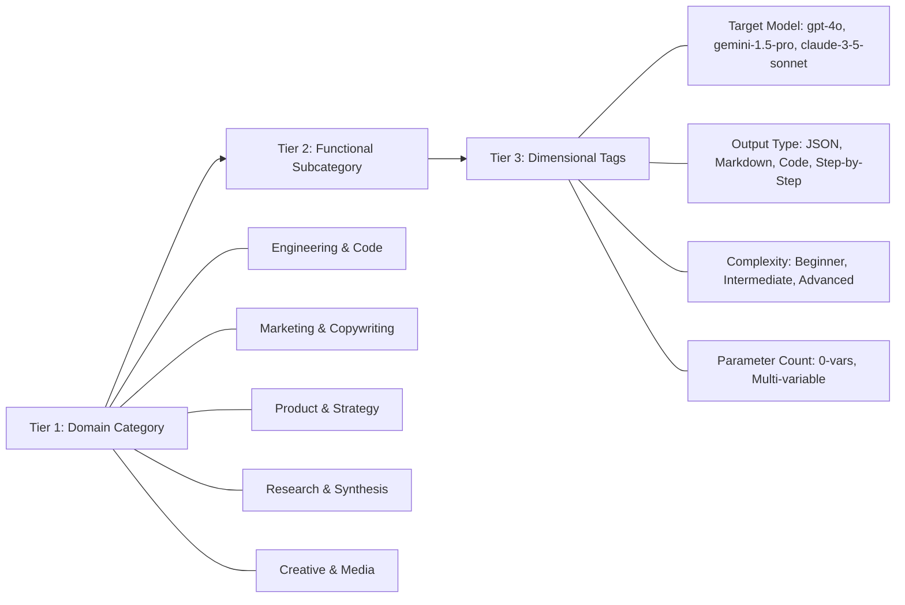
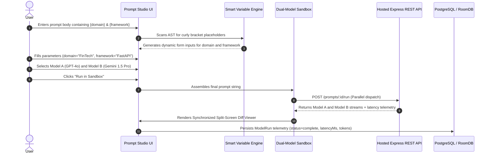
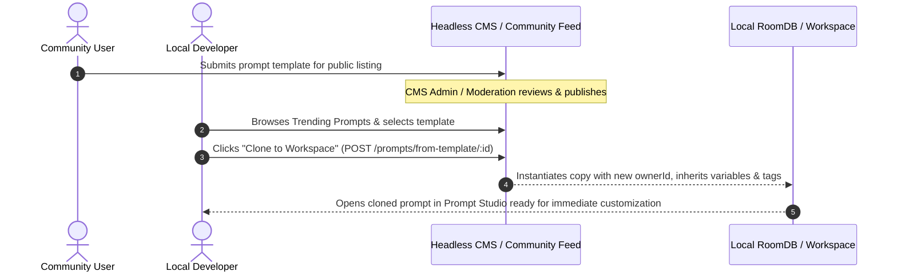

# VEX — Information Architecture Specification (Task 1.3)
**Author:** Bokamoso Sebake (BK — UI/UX Design Lead)  
**Project:** VEX AI Prompt Library (PROG7314 / INSY7315 Task 2)  
**Status:** Approved & Ready for Implementation  

---

## 1. Executive Summary & Architectural Goals

The **VEX AI Prompt Library** Information Architecture (IA) establishes an authoring-first, developer-centric hierarchy for managing, parameterizing, evaluating, and sharing Large Language Model (LLM) prompts.

### Core Architectural Goals:
1. **Zero-Latency Findability**: Hierarchical and faceted categorization (Coding, Marketing, Creative, Research, System Architecture) enabling sub-second filtering across thousands of prompts.
2. **Seamless Omnichannel Workflow**: Uniform taxonomy and mental models shared across the Android Native Client, the Responsive Web Workbench, and the Headless CMS.
3. **Execution-Centric Structure**: Unlike static copy-paste prompt repositories, VEX embeds the testing sandbox directly into the prompt lifecycle (Draft → Inject Variables → Dual-Model Run → Log Telemetry → Share).
4. **Governance & Role-Based Content Separation**: Clear demarcation between personal private workspaces, public community feeds, and editorial CMS-managed featured content.

---

## 2. High-Level System Sitemap & Navigation Hierarchy

```mermaid
graph TD
    Root[VEX Platform Root] --> Public[1.0 Public Web & Discovery]
    Root --> App[2.0 Personal Workspace / Studio]
    Root --> Community[3.0 Community Marketplace]
    Root --> Admin[4.0 Headless CMS & Admin Portal]

    %% 1.0 Public
    Public --> P_Home[1.1 Landing / Feature Showcase]
    Public --> P_Explore[1.2 Public Template Explorer]
    Public --> P_Share[1.3 Tokenized Shared Prompt View /shared/:token]
    Public --> P_Docs[1.4 Documentation & API Specs]

    %% 2.0 Studio
    App --> A_Library[2.1 My Library / Workbench]
    App --> A_Editor[2.2 Prompt Studio & Variable Injector]
    App --> A_Sandbox[2.3 Dual-Model Execution Sandbox]
    App --> A_History[2.4 Response History & Diff Analyzer]
    App --> A_Settings[2.5 Workspace & Model Settings]

    %% 3.0 Community
    Community --> C_Trending[3.1 Trending Prompts Feed]
    Community --> C_Featured[3.2 Staff Picks & Curated Collections]
    Community --> C_Detail[3.3 Community Prompt Detail & Fork]
    Community --> C_Submissions[3.4 User Submissions & Upvotes]

    %% 4.0 CMS Admin
    Admin --> M_Prompts[4.1 Curated Template Management]
    Admin --> M_Categories[4.2 Taxonomy & Tagging Manager]
    Admin --> M_Models[4.3 Model Provider & Endpoint Registry]
    Admin --> M_Moderation[4.4 Community Moderation Queue]
    Admin --> M_Audit[4.5 Telemetry & Audit Logs]
```

---

## 3. Global Navigation Matrix Across Breakpoints

| Navigation Component | Desktop (`> 1024px`) | Tablet (`768px – 1024px`) | Mobile (`< 768px`) |
| :--- | :--- | :--- | :--- |
| **Primary Navigation** | Fixed Left Sidebar (240px) with expandable grouped sections & quick keyboard shortcuts (`Cmd+K`, `N`). | Collapsible Sidebar (Icon-rail 72px expanding to overlay on hover/tap). | Persistent Bottom Navigation Bar (4 primary tabs + Center Action Button). |
| **Search & Quick Action** | Global Top Command Bar with instant fuzzy substring search across prompts, categories, and tags. | Header Search Icon expanding to full-width modal overlay. | Top Search Bar on Home/Explore views with filter chip drawer. |
| **Secondary & In-Context Actions** | Sticky contextual action bar / Right Inspector Panel (Model params, variables, token counts). | Sliding Right Flyout Drawer for parameters and variable configuration. | Bottom Sheet Modals for parameter tuning and variable injection forms. |
| **Breadcrumbs / Location** | Explicit hierarchical breadcrumb trail (`Workspace > Coding > SQL Optimizer > v2.1`). | Compact Back Button + Current Section title. | Top Bar Title with chevron back navigation. |

---

## 4. Content Taxonomy & Classification System

VEX organizes all prompt assets into a 3-tier taxonomy coupled with multi-dimensional metadata:

### Taxonomy Rules & Constraints:
* **Primary Category (Strict)**: Every prompt MUST belong to exactly one top-level category (`categoryId` foreign key).
* **Tags (Loose & Multi-valued)**: Zero or more lowercase alphanumeric tags for cross-cutting concerns (e.g., `refactoring`, `typescript`, `few-shot`).
* **System vs User Taxonomies**: System categories are provisioned via CMS and locked; users can define custom local tags within their own workspace.

---

## 5. Core User Journey Flows

### Flow 1: Create, Parameterize & Execute Prompt in Sandbox

### Flow 2: Fork Community Template to Local Workspace

---

## 6. Access Control & User Roles

| Capability / Resource | Anonymous Guest | Authenticated User | Content Editor / Reviewer | System Admin |
| :--- | :---: | :---: | :---: | :---: |
| Browse Public Templates & Documentation | ✅ Read-only | ✅ Read-only | ✅ Read-only | ✅ Full Access |
| Run Public Prompts with Temp Variables | ✅ (Rate limited) | ✅ (Full quota) | ✅ | ✅ |
| Personal Prompt CRUD & Local RoomDB Sync | ❌ | ✅ | ✅ | ✅ |
| Dual-Model Comparison Sandbox | ❌ | ✅ | ✅ | ✅ |
| Submit Prompt to Community Feed | ❌ | ✅ (Pending review) | ✅ (Auto-approved) | ✅ |
| Manage CMS Taxonomy & Featured Prompts | ❌ | ❌ | ✅ | ✅ |
| Configure Model API Providers & Quotas | ❌ | ❌ | ❌ | ✅ |
